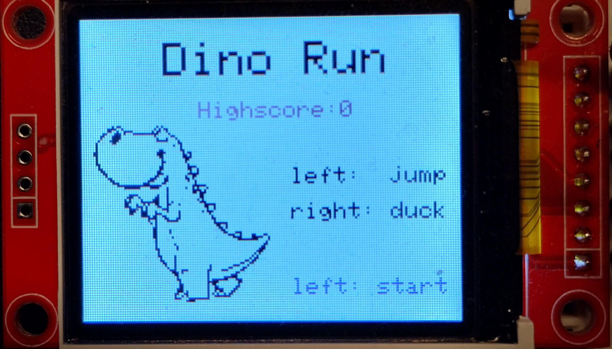
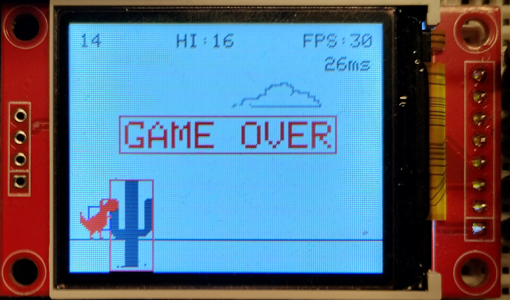
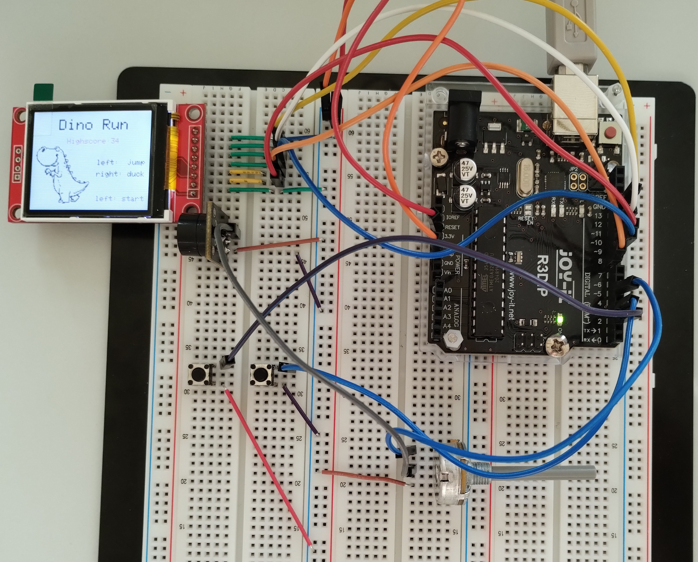

# MC-Beleg DinoRun

## Ziel und Zweck

Bei diesem Repository handelt es sich um eine Belegarbeit, welche für das Modul "Programmierung von Mikrocontrollern" von Prof. Dr.-Ing. Jörg Vogt entstanden ist. Ziel war die Implementierung des Spiels Dino-Run auf einem Arduino Uno Rev3. Dies geschah unter der Voraussetzung, dass mindestens ein Interrupt verwendet und Sound genutzt werden sollte. Der Beleg wurde Paul Marx und Eric Hübel erstellt.

Das Projekt ist zusätzlich unter https://wokwi.com/projects/432106437369207809 als Online-Version hinterlegt. Da es hier keinen ST7735-TFT gab, wird nur ein Teil des ILI9341-TFT verwendet.

## Spielablauf

Das Spiel wird mit einem Start-Bildschirm initialisiert. Der Startbildschirm gibt Auskunft über die Bedienung und zeigt den aktuellen Highscore an. Der Spielstart erfolgt durch das Drücken des linken Tasters. 



Der Dino wird über zwei Taster gesteuert, wobei der linke Taster für einen Sprung und der rechte Taster zum Ducken verwendet wird. Dabei gilt es den jeweiligen Hindernissen, zum Beispiel dem Flugdinosaurier oder den Kakteen, auszuweichen. Je länger der Dino nicht mit einem Hindernis kollidiert, desto mehr Punkte können gesammelt werden. Je 100 erreichte Punkte, nimmt die Spielgeschwindigkeit und somit die Schwierigkeit zu. 

Bei einer Kollision wird das Spiel mit einem Game-Over-Schriftzug angehalten und das Display wechselt wieder zu dem Start-Bildschirm.



## Inbetriebnahme

- Arduino via USB an PC anschließen
- Download der optimierten Adafruits GFX-Bibliothek unter: https://github.com/XarkLabs/PDQ_GFX_Libs
- Entpacken des Ordners und Kopie der Unterordner "PDQ_GFX" und "PDQ_ST7735" in den libraries-Ordner für Arduino
- BelegFlash.ino in der Arduino IDE öffnen
- Unter Werkzeuge das jeweilige Board (Arduino Uno) auswählen und unter Werkzeuge den Port des Arduinos auswählen
- Arduino flashen über das Drücken des Upload-Buttons
  
## Hardware

- Arduino UNO Rev.3
- 2 Taster → Spielsteuerung
- Passive Buzzer → Ausgabe verschiedener Melodien
- Potentiometer → Schaltet den Buzzer bei Bedarf stumm
- 1,8 Zoll (4,57 cm) SPI TFT Display ST7735 mit 128 x 160 Pixeln → Darstellung des Spiels



## Programmstruktur

**Sprite-Definition und Initialisierung**

*Dino-Sprite:*

| Variable   | Typ     | Beschreibung                                                                      |
| ---------- | ------- | --------------------------------------------------------------------------------- |
| x          | int     | x-Koordinate                                                                      |
| y          | int     | y-Koordinate                                                                      |
| yStart     | int     | Starthöhe des Dinos                                                               |
| width      | int     | Breite des Dinos                                                                  |
| height     | int     | Höhe des Dinos                                                                    |
| duckWidth  | int     | Breite beim Ducken                                                                |
| duckHeight | int     | Höhe beim Ducken                                                                  |
| jumping    | bool    | Gibt an, ob der Dino gerade springt                                               |
| ducking    | bool    | Gibt an, ob der Dino gerade geduckt ist                                           |
| frame      | int     | Steuert die Animation; wechselt zwischen 0 und 1                                  |
| padding    | int     | Abstand zur Kollisionsbox                                                          |

*Wolken/Vogel/Kakteen:*

- Auswahl erfolgt über enum:

```cpp
enum SpriteType {
  SPRITE_CACTUS,
  SPRITE_CACTUS2,
  SPRITE_CACTUS3,
  SPRITE_CACTUS4,
  SPRITE_BIRD,
  SPRITE_CLOUD
};
```
- Definition der Sprites:

| Variable   | Typ        | Beschreibung                                                                      |
| ---------- | ---------- | --------------------------------------------------------------------------------- |
| type       | SpriteType | Typ: Cactus 1-4, Bird, Cloud                                                   |
| x          | int        | x-Koordinate                                                                   |
| y          | int        | y-Koordinate                                                                   |
| width      | int        | Breite                                                                         |
| height     | int        | Höhe                                                                           |
| dx         | int        | Verschiebung des Sprites auf der x-Achse                                       |
| frame      | int        | Steuert die Animation; wechselt zwischen 0 und 1                               |

- Initialisierung über ```initCloud()```, ```initBird()```, ```initCactus()```, ```initCactus2()``` etc.
- zufällige Auswahl aus dem Array ```validObstacles[]```
  
**Kollisionserkennung**

- AABB (Axis-Aligned Bounding Box): https://kishimotostudios.com/articles/aabb_collision/
    - Funktion ```checkAABBCollision()``` prüft, ob sich Rechtecke überlappen
    - Hitbox-Anpassung möglich durch ```padding```
    - Separate Logik fürs Ducken
- Kollisions-Folge:
    - die globale Variable dead wird auf true gesetzt und das Spiel endet   

**Spiel-Logik**

- Hindernisse:
  - nutzt ```bool newObstacle``` zur Steuerung
  - zufällige Auswahl über:
  ```cpp
   if (newObstacle == true) {  // neues Obstacles setzen
    randomSeed((int)millis());
    int randomObs = random(0, validObstaclesLength);
    obstacle = validObstacles[randomObs];

    switch (obstacle->type) {  // initialiseren des Objekts
      case SPRITE_CACTUS: initCactus(); break;
      case SPRITE_CACTUS2: initCactus2(); break;
      case SPRITE_CACTUS3: initCactus3(); break;
      case SPRITE_CACTUS4: initCactus4(); break;
      case SPRITE_BIRD: initBird(); break;
    }
    newObstacle = false;
  }
   ```
- Dino-Steuerung
  - Springen: Parabelberechnung anteilig zur vergangenen Sprungzeit; individuell anpassbar über ```steepness``` (Anstieg), ```JUMP_HEIGHT``` (Sprunghöhe) und ```jump_duration``` (Sprungzeit)
  - Taster-Interrupt für ```JMP_BUTTON_PIN```
  - Ducken: Y-Offset-Anpassung
 
- Spielzustände:
    - ```game_start_flag```: signalisiert, dass Titelbildschirm mit Startmelodie angezeigt/abgespielt werden soll
    - ```dead```: signalisiert, dass Game-Over-Bildschirm angezeigt werden soll

**Sound**

- ```playMelody()``` steuert den Sound
- nicht blockierend durch die Verwendung von ```millis()```
- Sound für: Sprung, Startbildschirm, Game-Over

**setup()**

- Registriert Interrupt für heruntergedrückten Sprung-Taster:
  ```cpp
  attachInterrupt(digitalPinToInterrupt(JMP_BUTTON_PIN), jumpButtonFunc, FALLING);
  ```
- Konfiguriert die Input-PINs:
  ```cpp
  pinMode(DUCK_BUTTON_PIN, INPUT_PULLUP);
  pinMode(JMP_BUTTON_PIN, INPUT_PULLUP);
  ```
  - Öffnen der seriellen Schnittstelle und Festlegen der Datenrate
   ```cpp
  Serial.begin(115200);
  ```
- Display-Konfiguration für PDQ_ST7735
- Initialisierung des Spiels mit ```reset()```

**loop()**

- Rendering
  - drawFrame(): zeichnet die Sprites
  - updateMelody(): aktualisiert den Sound
- Game-Over
    - HighScore-Update
    - Rückkehr zum Titelbildschirm
  - Startbildschirm
    - aufgerufen über draw_start_screen()
    - zeigt Highscore
    - wartet auf Tastendruck zum Spielstart
  - Erhöht die Spielgeschwindigkeit bis 800 Punkte
  - animiert jeden 4. Frame und erhöhen des Scores

## Weiterentwicklung

- Boden grafisch aufwerten und bspw. Steine einfügen
- Mehrere Gegner/Hindernisse gleichzeitig
- Weitere und neue Hindernisse, wie Schluchten oder andere Dinosaurier
