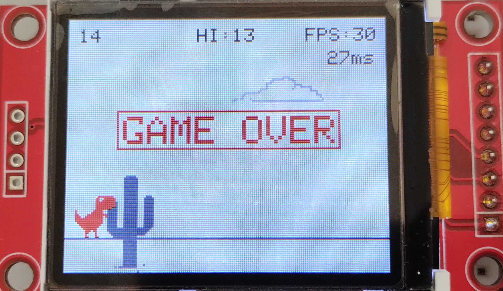

# MC-Beleg-DinoRun

## Ziel und Zweck

Bei diesem Repository handelt es sich um eine Belegarbeit, welche für das Modul "Programmierung von Mikrocontrollern" von Prof. Dr.-Ing. Jörg Vogt entstanden ist. Ziel war die Implementierung des Spiels Dino-Run auf einem Arduino Uno Rev3. Dies geschah unter den Voraussetzung, dass mindestens ein Interrupt verwendet und Sound genutzt werden sollte. Der Beleg wurde Paul Marx und Eric Hübel erstellt.

## Spielablauf

Das Spiel wird mit einem Start-Bildschirm initialisiert. Der Startbildschirm gibt Auskunft über die Bedienung und zeigt den aktuellen Highscore an. Der Spielstart erfolgt durch das Drücken des linken Tasters. 

Der Dino wird über zwei Taster gesteuert, wobei der linke Taster für einen Sprung und der rechte Taster zum Ducken verwendet wird. Dabei gilt es den jeweiligen Hindernissen, zum Beispiel dem Flugdinosaurier oder den Kakteen, auszuweichen. Je länger der Dino nicht mit einem Hindernis kollidiert, desto mehr Punkte können gesammelt werden. Je 100 erreichte Punkte, nimmt die Spielgeschwindkeit und somit die Schwierigkeit zu. 

Bei einer Kollision wird das Spiel mit einem Game-Over-Schriftzug angehalten und das Display wechselt wieder zu dem Start-Bildschirm.

## Inbetriebnahme

- Arudino via USB an PC anschließen
- Download der optimierten Adafruits GFX-Bibliothek unter: https://github.com/XarkLabs/PDQ_GFX_Libs
- Entpacken des Ordners und Kopie der Unterordner "PDQ_GFX" und "PDQ_ST7735" in den libraries-Ordner für Arduino
- BelegFlash.ino in der Arudino IDE öffnen
- Unter Werkzeuge das jeweilige Board (Arduino Uno) auswählen und unter Werkzeuge den Port des Arduinos auswählen
- Arudino flashen über das Drücken des Upload-Buttons
  
## Hardware

## Programmstruktur

## Weiterentwicklung
